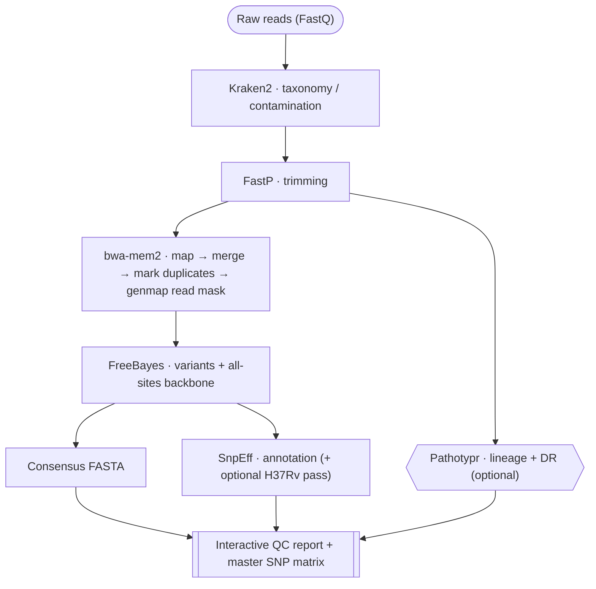

# Introduction

**BAMpiro** is a modular, containerized bioinformatics pipeline built with
**Nextflow (DSL2)**. It is optimized by default for *Mycobacterium tuberculosis*
(TB), but its architecture is **organism-agnostic** and works on **any bacterial
genome** (e.g. *E. coli*, *Salmonella*, *Staphylococcus*) by adjusting a few
parameters.

It automates the whole path from raw reads to annotated variants, consensus
sequences, and a consolidated interactive quality-control report.

## Key features

-   :material-earth:{ .lg .middle } &nbsp; **Universal bacterial support**

    ---

    Any reference genome + GFF annotation. References are indexed and their SnpEff
    databases built on the fly.

-   :material-content-cut:{ .lg .middle } &nbsp; **Repeat & blind-spot masking**

    ---

    `nucmer` (MUMmer4) excludes repeats, a length-aware `genmap` filter drops
    unplaceable reads, plus optional [H37Rv blind-spot masking](pathotypr.md#blind-spot-masking-h37rv-problematic-sites)
    lifted onto any reference.

-   :material-broom:{ .lg .middle } &nbsp; **Robust QC**

    ---

    `FastP` cleaning on every sample, plus `Kraken2` taxonomic contamination checks
    whenever you point `--kraken2_db` at a database.

-   :material-target:{ .lg .middle } &nbsp; **Variant calling & backbone**

    ---

    `FreeBayes` with configurable ploidy (1 or 2) and strict filtering, plus
    "all-sites" VCFs (WT + variants) for phylogenetic supermatrices.

-   :material-dna:{ .lg .middle } &nbsp; **Lineage & drug-resistance typing**

    ---

    Alignment-free (k-mer) MTBC lineage + WHO drug-resistance genotyping with
    [Pathotypr](pathotypr.md) - reference-agnostic and bundled in the container.

-   :material-chart-box:{ .lg .middle } &nbsp; **Interactive QC report**

    ---

    One self-contained HTML dashboard (21 panels) + a machine-readable per-sample
    `qc_flags.tsv`, alongside the classic MultiQC report. See the
    [QC report](qc-report.md).

-   :material-table-large:{ .lg .middle } &nbsp; **Master SNP matrix**

    ---

    A cohort-wide `snp_matrix.tsv` (rows = SNP sites, columns = reference /
    annotation + per-sample allele frequency & depth) for phylogenetics. On by
    default.

-   :material-package-down:{ .lg .middle } &nbsp; **Flexible alignment output**

    ---

    Publish alignments as reference-compressed **CRAM** (~40-50% smaller than BAM)
    via `--output_cram`; the reference FASTA is published alongside so the CRAMs
    stay self-decodable.

-   :material-map-marker-path:{ .lg .middle } &nbsp; **Canonical (H37Rv) numbering**

    ---

    Optionally show every variant's H37Rv **coordinate** (alignment-free k-mer
    [liftover](pathotypr.md#reference-agnostic-coordinates-k-mer-liftover)) and
    **amino-acid** change alongside the mapping-reference ones, with Mycobrowser
    (`Rv…`) gene links.

## Workflow summary

1. **Reference** - indexing + repeat masking + SnpEff DB building.
2. **QC** - read validation → Kraken2 (taxonomy, only with `--kraken2_db`) → FastP
   (trimming).
3. **Pathotypr** *(optional)* - alignment-free MTBC lineage (nested sub-lineage)
   **and** WHO drug-resistance typing from reads.
4. **Mapping** - `bwa-mem2` alignment → merge runs → mark duplicates (`samtools`) →
   length-aware read masking (`genmap`).
5. **Variants** - `FreeBayes` calling + `mpileup` for backbone generation.
6. **Consensus** - FASTA generation, masking low-coverage / low-quality sites.
7. **Annotation** - `SnpEff` annotation of main and legacy VCFs (+ optional
   canonical/H37Rv pass for [dual amino-acid numbering](pathotypr.md#dual-amino-acid-numbering-h37rv--mycobrowser)).
8. **Report** - aggregation into the classic MultiQC report **and** the interactive
   [HTML QC report](qc-report.md) with per-sample PASS/WARN/FAIL flags, **plus a
   cohort-wide master SNP matrix TSV** (rows = SNP sites, columns = reference /
   annotation + per-sample AF & depth).

---

Next: [Installation](installation.md) · [Quick Start](quickstart.md)
